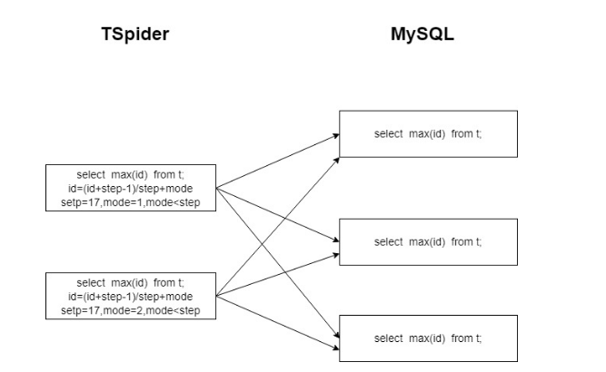

# TenDB Cluster自增列

TenDB Cluster只保证自增ID的唯一性，不保证连续和递增。当前各个TSpider节点维护各自的自增值，并保证各个节点维护的自增id不会产生重复。


## 用法

TSpider主要通过三个参数维护自增列：

```
spider_auto_increment_mode_switch用于控制是否启用TSpider自增列功能
spider_auto_increment_mode_value为当前TSpider节点自增列值模spider_auto_increment_step后的值
spider_auto_increment_step为步长，当前TSpider节点以这个步长为自增单位
```
<font color="#dd0000">需要保证各个TSpider节点spider_auto_increment_step相同和 spider_auto_increment_mode_value 不同</font> 
，如果某TSpider节点参数如下：

```
spider_auto_increment_mode_switch=1
spider_auto_increment_mode_value=3
spider_auto_increment_step=17
```
那么此TSpider节点上自增列依次为 3 20 37 54 ...

## 原理
让各个TSpider节点维护各自的自增值，并保证各个TSpider节点不会生成相同的自增值。TSpider也是一个mysql节点，每个自增列表中都有自己的last_insert_id。如果整个集群中的各个TSpider节点都使用自己维护的last_insert_id，性能必然很好（本地维护，无网络交互）。

但整个集群会有多个TSpider节点，如果按传统的自增方式每个TSpider节点自己维护的话，则必然重复键冲突。但根据目前的业务特点：自增列值无实际意义，大都是做为唯一标识，即不对生成顺序无要求。

为此，可以让每个节点维护一个的id%m=n，而每个节点的n值不同。比如节点1维护的序列为：1，1+17，1+17+17，节点2维护的序列为2，2+17，2+17+17…依次类推。只有在需要获取最大值的时候，才从后端TenDB中求一个max(id)，再通过max(id)生成一个本地id。下图所示，为在极端情况下需要从后端TenDB来生成唯一id的方式。



## 注意

 1. 多机自增auto_increment问题，如果有自增列，必须使用bigint类型，只能保证唯一，不保证递增。
 2. 需要保证各个TSpider节点 spider_auto_increment_mode_value 不同。